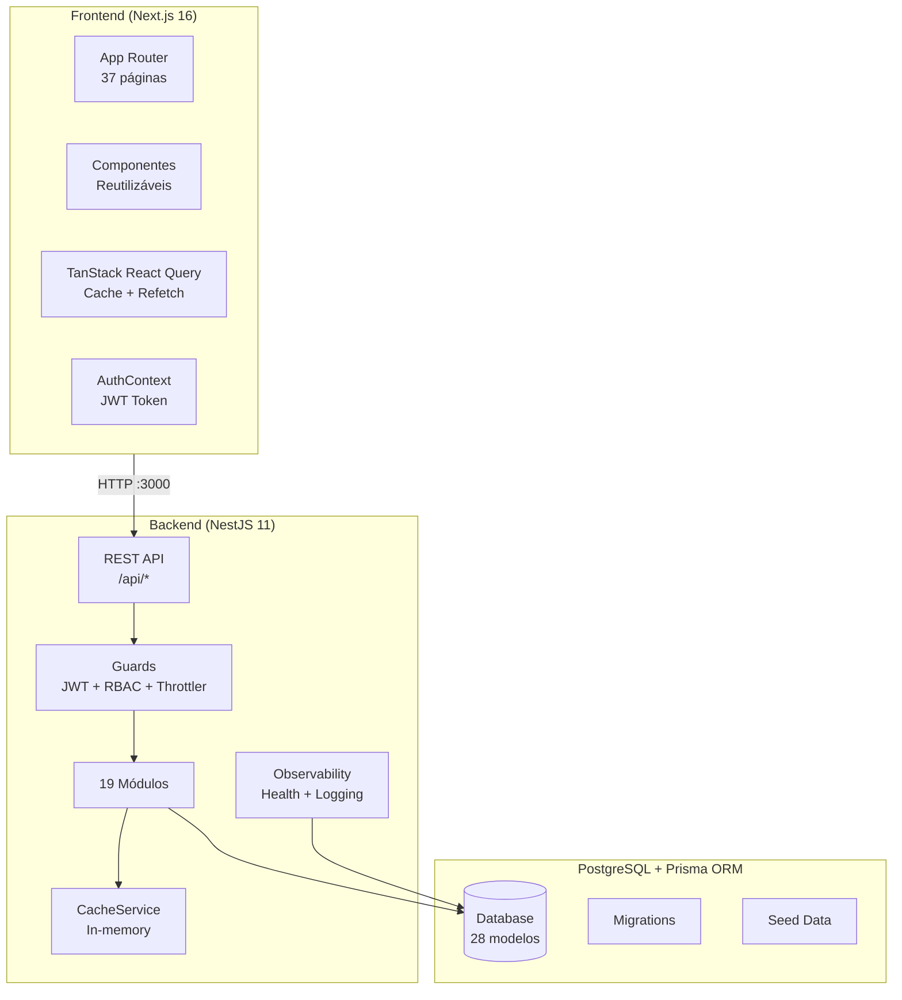
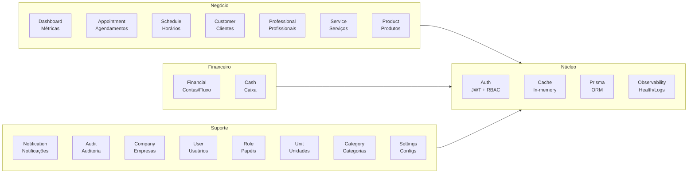
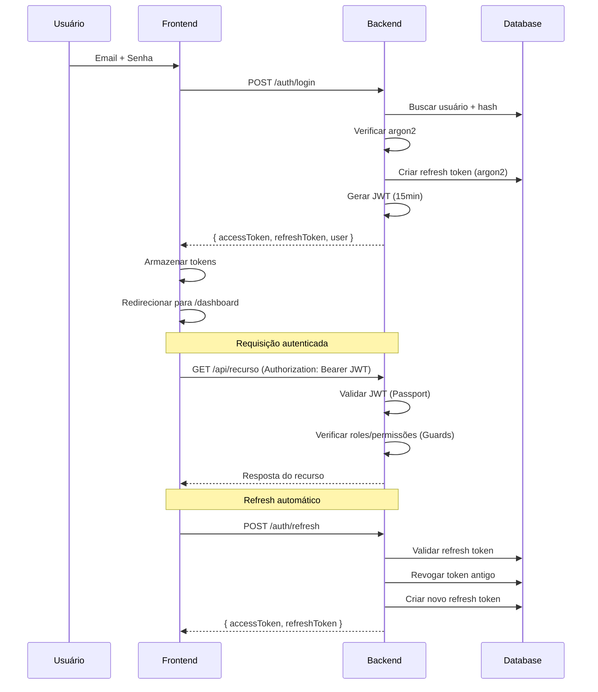
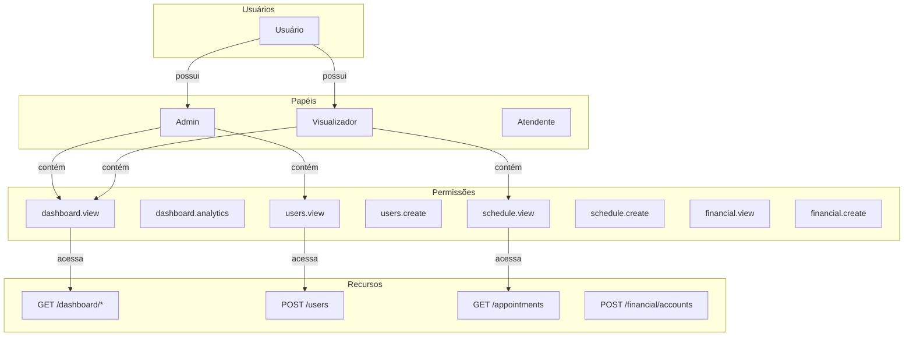
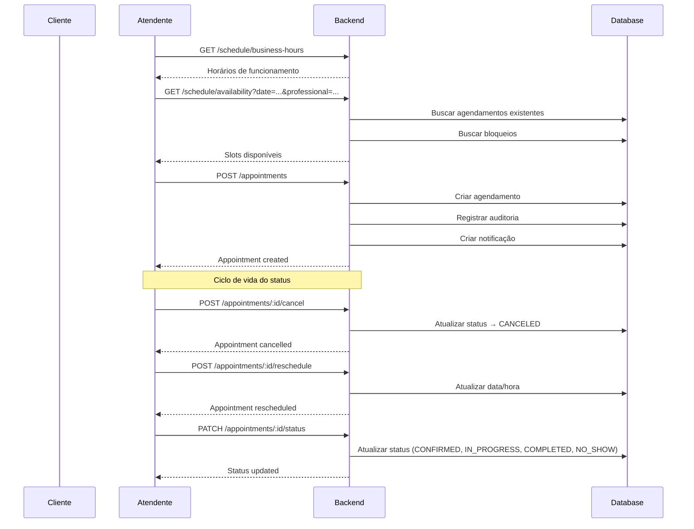
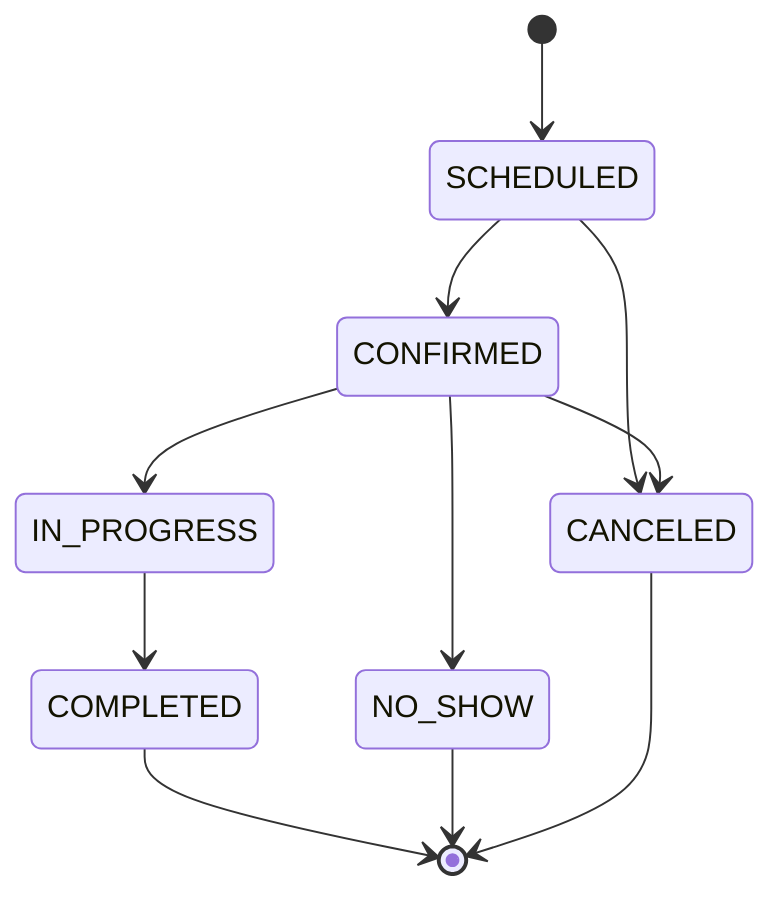
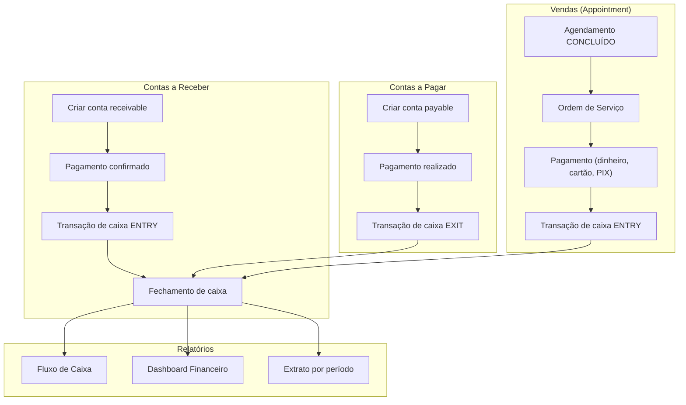

# Arquitetura do Sistema

## Visão geral

O Barbershop ERP segue uma arquitetura **monolítica modular** no backend (NestJS) com frontend separado (Next.js). A comunicação entre frontend e backend ocorre via REST API com autenticação JWT.

---

## Módulos do backend

### Lista completa (19 módulos)

| Módulo | Responsabilidade |
|---|---|
| `auth` | Autenticação JWT, refresh token, RBAC |
| `dashboard` | Métricas, gráficos, alertas |
| `appointment` | Agendamentos, status, reagendamento |
| `schedule` | Horários de funcionamento, bloqueios, disponibilidade |
| `customer` | CRUD de clientes |
| `professional` | CRUD de profissionais |
| `service` | CRUD de serviços |
| `category` | CRUD de categorias de produtos |
| `product` | CRUD de produtos, estoque |
| `unit` | CRUD de unidades/filiais |
| `user` | CRUD de usuários, vínculo com papéis |
| `company` | CRUD de empresas |
| `company-settings` | Configurações da empresa (logo, cores) |
| `financial` | Contas a pagar/receber, fluxo de caixa |
| `notifications` | Notificações push/in-app |
| `audit` | Logs de auditoria de todas as ações |
| `observability` | Health checks, request ID, logging |
| `role` | Papéis e permissões |
| `cache` | Cache in-memory com TTL |

---

## Fluxo de autenticação

### Componentes da autenticação

- **JwtAuthGuard** — Estende `AuthGuard('jwt')` do Passport. Verifica se o token JWT é válido.
- **RolesGuard** — Lê o decorator `@Roles()` e consulta os papéis do usuário no banco.
- **PermissionsGuard** — Lê o decorator `@Permissions()` e verifica se o usuário possui **todas** as permissões exigidas. Administradores (`admin`) têm acesso total.

---

## RBAC (Role-Based Access Control)

---

## Fluxo de agendamento

### Ciclo de vida do agendamento

---

## Fluxo financeiro

---

## Notificações

O módulo de notificações segue o padrão **Observer**: serviços disparam eventos e o módulo persiste as notificações no banco.

**Tipos de notificação:**
- `APPOINTMENT_REMINDER` — Lembrete de agendamento
- `APPOINTMENT_CANCELLED` — Cancelamento
- `FINANCIAL_OVERDUE` — Conta vencida
- `STOCK_LOW` — Estoque baixo
- `SYSTEM_ALERT` — Alerta do sistema

---

## Auditoria

O módulo de auditoria registra **todas as operações** de escrita (CREATE, UPDATE, DELETE, LOGIN, LOGOUT) em uma tabela separada (`audit_logs`).

**Dados registrados:**
- Usuário que executou a ação
- Tipo de ação
- Entidade afetada
- ID da entidade
- Dados anteriores e novos (JSON)
- Timestamp

---

## Cache

O `CacheService` é um cache **in-memory** baseado em `Map` do JavaScript, com TTL configurável via `CACHE_TTL` (default: 300s).

**Estratégias de invalidação:**
- **Leitura:** `getOrSet(key, fn)` — busca do cache ou executa a função
- **Escrita:** `del(key)` / `delByPrefix(prefix)` — invalida entradas específicas ou por prefixo
- **Reset:** `reset()` — limpa todo o cache

**Módulos com cache:**
- Dashboard (summary, financial, operations)
- Unit (findAllSimple, findOne)
- CompanySettings (findOne)
- Service (findAll, findOne)
- Category (findAll, findOne)
