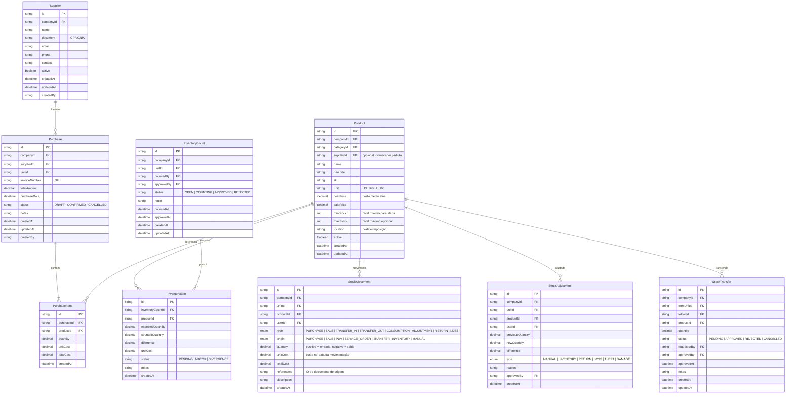
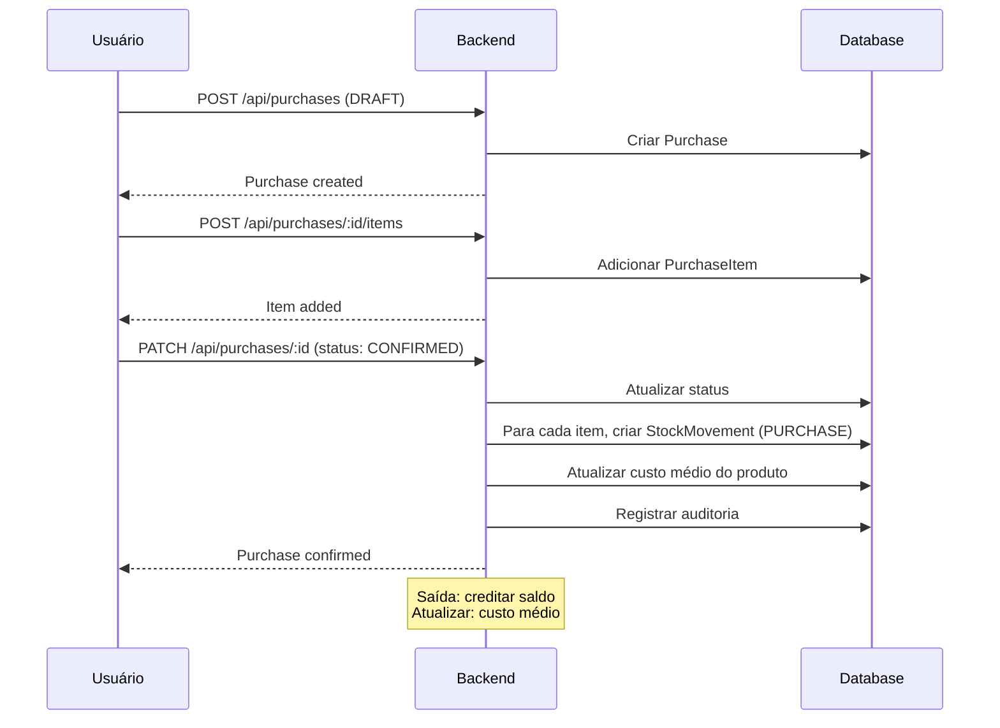
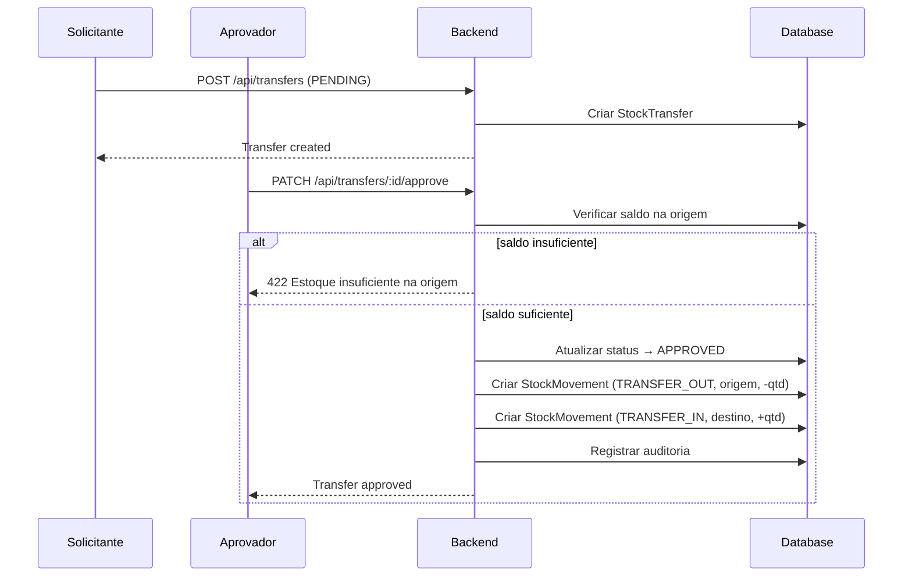
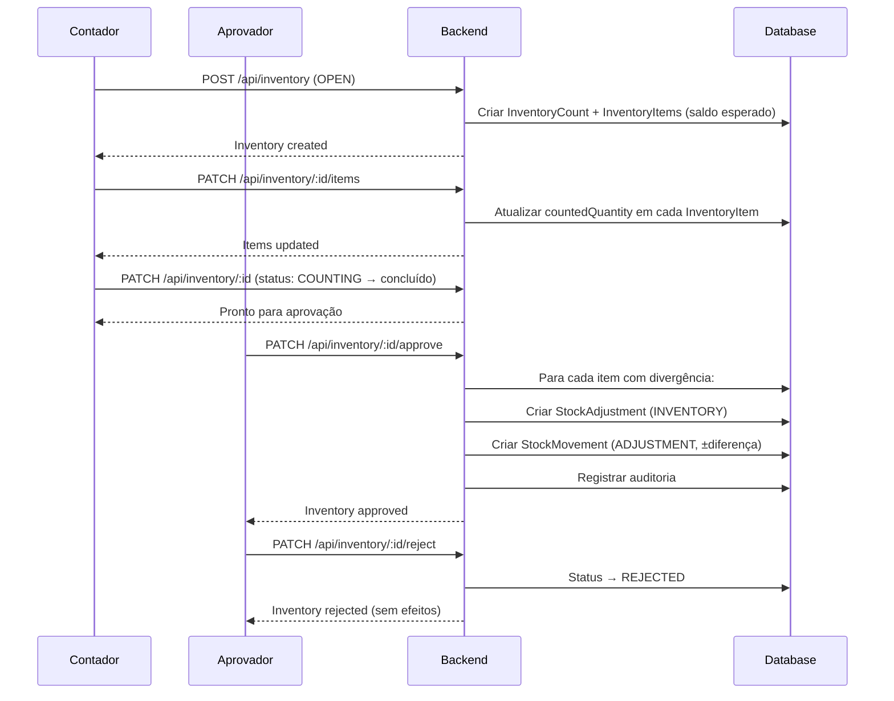

# Estoque — Modelagem de Domínio

> Sprint 017.0 — Documentação técnica do módulo de estoque avançado.
> Nenhuma implementação de código. Apenas modelagem, regras e validação.

---

## Visão geral

O módulo de estoque evolui de um simples registro de saldo para um sistema completo de gestão: compras, movimentações, transferências entre unidades, inventário, ajustes e alertas. O saldo de cada produto em cada unidade é **calculado exclusivamente pela soma das movimentações** — nunca armazenado como valor absoluto sem rastreabilidade.

---

## Entidades



---

## Enums

### StockMovementType

Define o tipo da movimentação. Determina o sinal (entrada/saída) e o impacto no custo médio.

| Valor | Sinal | Atualiza custo médio | Descrição |
|---|---|---|---|
| `PURCHASE` | + | Sim | Entrada por compra de fornecedor |
| `SALE` | — | Não | Saída por venda no PDV |
| `TRANSFER_IN` | + | Não | Entrada por transferência de outra unidade |
| `TRANSFER_OUT` | — | Não | Saída por transferência para outra unidade |
| `CONSUMPTION` | — | Não | Baixa por consumo interno (ex: serviço) |
| `ADJUSTMENT` | ± | Não | Ajuste manual ou de inventário |
| `RETURN` | + | Sim | Devolução de cliente ou fornecedor |
| `LOSS` | — | Não | Perda, furto, avaria |

### StockMovementOrigin

Registra qual subsistema gerou a movimentação, para rastreabilidade.

| Valor | Descrição |
|---|---|
| `PURCHASE` | Originado de uma compra |
| `SALE` | Originado de uma venda no PDV |
| `PDV` | Originado do frente de caixa |
| `SERVICE_ORDER` | Originado de ordem de serviço (consumo) |
| `TRANSFER` | Originado de transferência entre unidades |
| `INVENTORY` | Originado de contagem de inventário |
| `MANUAL` | Originado de ajuste manual |

### PurchaseStatus

| Valor | Descrição |
|---|---|
| `DRAFT` | Rascunho, ainda não finalizada |
| `CONFIRMED` | Confirmada, gera movimentações de entrada |
| `CANCELLED` | Cancelada, não gera efeitos |

### TransferStatus

| Valor | Descrição |
|---|---|
| `PENDING` | Aguardando aprovação |
| `APPROVED` | Aprovada, movimentações geradas |
| `REJECTED` | Rejeitada |
| `CANCELLED` | Cancelada |

### InventoryStatus

| Valor | Descrição |
|---|---|
| `OPEN` | Inventário criado, aguardando contagem |
| `COUNTING` | Em processo de contagem |
| `APPROVED` | Aprovado, ajustes gerados automaticamente |
| `REJECTED` | Rejeitado, nenhum ajuste aplicado |

### AdjustmentType

| Valor | Descrição |
|---|---|
| `MANUAL` | Ajuste manual (justificativa obrigatória) |
| `INVENTORY` | Ajuste gerado por inventário |
| `RETURN` | Devolução de produto |
| `LOSS` | Perda não identificada |
| `THEFT` | Furto |
| `DAMAGE` | Avaria |

---

## Regras de negócio

### 1. Saldo calculado por movimentações

O saldo de cada produto em cada unidade é a soma de **todas as movimentações** daquele produto naquela unidade.

```
saldo_atual = SUM(quantity) WHERE unitId = X AND productId = Y
```

O modelo `Stock` existente pode ser mantido como cache de leitura (atualizado via trigger ou após cada movimentação), mas a **fonte da verdade** é a tabela `StockMovement`.

### 2. Custo médio

O custo médio é atualizado **somente nas entradas** (PURCHASE, RETURN):

```
custo_medio = (saldo_anterior * custo_medio_anterior + qtd_entrada * custo_unitario) / (saldo_anterior + qtd_entrada)
```

- Nas saídas, o custo médio não se altera.
- O custo de cada saída é registrado no momento da movimentação (custo médio vigente).

### 3. Estoque negativo (configurável)

Por padrão, o sistema **permite** estoque negativo (configurável por empresa). Quando desabilitado:

- Vendas/consumos são bloqueados se o saldo for insuficiente.
- Transferências e ajustes não são bloqueados (casos de correção).

### 4. Auditoria obrigatória

Toda movimentação deve registrar:

- `userId` — quem executou
- `createdAt` — quando
- `description` — por quê

Além disso, operações de escrita (compra, ajuste, transferência, inventário) disparam logs no módulo de auditoria (`AuditService`).

### 5. Transferência = duas movimentações

Uma transferência aprovada gera **duas** movimentações:

| Unidade | Tipo | Quantidade |
|---|---|---|
| Origem | `TRANSFER_OUT` | — (negativo) |
| Destino | `TRANSFER_IN` | + (positivo) |

Ambas compartilham o mesmo `referenceId` (ID da transferência) para rastreabilidade.

### 6. Inventário gera ajustes automáticos

Quando um inventário é **aprovado**:

- Para cada `InventoryItem` com diferença != 0, gera um `StockAdjustment` do tipo `INVENTORY`.
- O ajuste gera uma `StockMovement` do tipo `ADJUSTMENT` com a quantidade exata da diferença.
- Ajustes de inventário **não** recalcularn o custo médio.

### 7. Sequência de aprovação

Operações que requerem aprovação:
- **Transferência:** solicitante ≠ aprovador (separaçao de职责)
- **Inventário:** contador ≠ aprovador
- **Ajuste manual:** valor acima de limite configurável requer aprovação

---

## Invariantes do Estoque

Regras que **nunca** podem ser violadas, em nenhum cenário. Servem como contratos para implementação, testes e auditoria.

| # | Invariante | Violação detectável em |
|---|---|---|
| 1 | O saldo de um produto **nunca** é alterado diretamente na tabela `Stock`. Toda alteração passa por `StockMovement`. | Teste de unidade, trigger de banco |
| 2 | Toda alteração de saldo gera **exatamente uma** `StockMovement`. Não existe caminho de código que altere saldo sem movimento. | Revisão de código, cobertura de testes |
| 3 | Uma `StockMovement` **nunca** é editada após criada. O campo `quantity` é imutável. | Constraint no banco (UPDATE bloqueado), teste de integração |
| 4 | Exclusão física (`DELETE`) de `StockMovement` é **proibida**. Cancelamentos usam movimentações compensatórias (ex: `ADJUSTMENT` com sinal oposto). | Hook no Prisma, trigger no banco |
| 5 | O custo médio (`Product.costPrice`) **nunca** é recalculado em saídas. Apenas entradas (`PURCHASE`, `RETURN`) o alteram. | Teste de unidade |
| 6 | Toda movimentação pertence a **uma empresa** (`companyId`) e **uma unidade** (`unitId`). Não existe movimentação global. | Validação no DTO, constraint no banco |
| 7 | Uma transferência aprovada gera **sempre duas** movimentações: `TRANSFER_OUT` na origem e `TRANSFER_IN` no destino, com quantidades iguais em módulo. | Teste de integração |
| 8 | Um inventário aprovado gera **um ajuste por item divergente**. Itens sem divergência não geram movimentação. | Teste de integração |
| 9 | O campo `referenceId` em `StockMovement` é obrigatório quando `origin ≠ MANUAL`. Garante rastreabilidade. | Validação no service |
| 10 | O estoque negativo **pode** ocorrer se a configuração da empresa permitir. Se não permitir, a operação é bloqueada **antes** da movimentação. | Teste de unidade, guard no service |

---

## Fluxos

### Fluxo de compra



### Fluxo de transferência



### Fluxo de inventário



---

## Endpoints da API

| Método | Rota | Descrição |
|---|---|---|
| `GET` | `/api/products` | Listar produtos (com estoque agregado) |
| `POST` | `/api/products` | Criar produto |
| `PATCH` | `/api/products/:id` | Atualizar produto |
| `DELETE` | `/api/products/:id` | Remover produto |
| `GET` | `/api/products/:id/movements` | Histórico de movimentações |
| `GET` | `/api/products/:id/balance` | Saldo atual por unidade |

| `GET` | `/api/suppliers` | Listar fornecedores |
| `POST` | `/api/suppliers` | Criar fornecedor |
| `PATCH` | `/api/suppliers/:id` | Atualizar fornecedor |

| `GET` | `/api/purchases` | Listar compras |
| `POST` | `/api/purchases` | Criar compra (DRAFT) |
| `POST` | `/api/purchases/:id/items` | Adicionar item |
| `PATCH` | `/api/purchases/:id` | Atualizar (CONFIRMED → gera entradas) |
| `DELETE` | `/api/purchases/:id` | Cancelar |

| `GET` | `/api/stock/movements` | Listar movimentações (filtro por produto/unidade/tipo/período) |
| `POST` | `/api/stock/movements` | Movimentação manual |

| `GET` | `/api/stock/transfers` | Listar transferências |
| `POST` | `/api/stock/transfers` | Solicitar transferência |
| `PATCH` | `/api/stock/transfers/:id/approve` | Aprovar |
| `PATCH` | `/api/stock/transfers/:id/reject` | Rejeitar |

| `GET` | `/api/stock/inventory` | Listar inventários |
| `POST` | `/api/stock/inventory` | Criar inventário |
| `PATCH` | `/api/stock/inventory/:id/items` | Atualizar itens contados |
| `PATCH` | `/api/stock/inventory/:id/finish` | Finalizar contagem |
| `PATCH` | `/api/stock/inventory/:id/approve` | Aprovar (gera ajustes) |
| `PATCH` | `/api/stock/inventory/:id/reject` | Rejeitar |

| `GET` | `/api/stock/adjustments` | Listar ajustes |
| `POST` | `/api/stock/adjustments` | Criar ajuste manual |

| `GET` | `/api/stock/reports/position` | Posição atual de estoque |
| `GET` | `/api/stock/reports/movements` | Relatório de movimentações |
| `GET` | `/api/stock/reports/cost-evolution` | Evolução do custo médio |
| `GET` | `/api/stock/reports/low-stock` | Produtos abaixo do mínimo |

---

## Camadas do módulo (NestJS)

```
src/modules/stock/
├── stock.module.ts
├── stock.controller.ts
├── stock.service.ts
├── dto/
│   ├── create-supplier.dto.ts
│   ├── create-purchase.dto.ts
│   ├── create-movement.dto.ts
│   ├── create-transfer.dto.ts
│   ├── create-inventory.dto.ts
│   ├── create-adjustment.dto.ts
│   └── stock-report-query.dto.ts
├── entities/ (Prisma — schema.prisma)
└── stock-report.service.ts
```

**Ou, se a complexidade justificar, dividir em sub-módulos:**

```
src/modules/stock/
├── stock.module.ts          (agrega os sub-módulos)
├── purchases/               (compras + fornecedores)
├── movements/                (movimentações + saldo)
├── transfers/                (transferências)
├── inventory/                (inventário + ajustes)
└── reports/                  (relatórios)
```

---

## Pendências para Sprint 017.1

- [ ] Validar regras de negócio com o cliente/usuário
- [ ] Aprovar nomenclatura dos enums e entidades
- [ ] Decidir entre módulo único ou sub-módulos
- [ ] Definir política de estoque negativo (por empresa)
- [ ] Escolher biblioteca de cálculos decimais (ex: `decimal.js`)
- [ ] Revisar índices do banco
